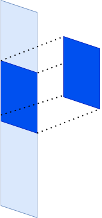
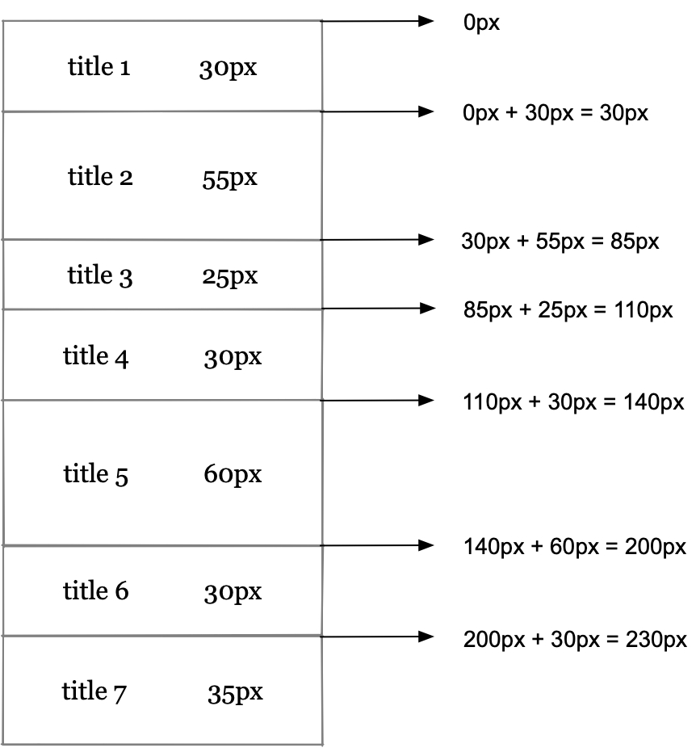

# 看完就懂的虚拟列表实现

## 从自然滚动开始

如果容器的宽度或者高度固定，当内容的在某个方向上的度量大于容器时，同时给容器添加 `overflow: auto` 或者 `overflow: scroll`时， 就会在该方向上出现滚动条。



如上图，蓝色背景的容器，其内容的高度比容器本身要高，所以内部就出现了滚动条。滚动时，我们所能看到的内容就是容器在内容上的正交投影内的区域，也是内容的**可视区域**。


## 自然滚动：内容撑开

自然滚动在代码实现上也是很基础的

- 首先需要一个容器

```html
<div class="box"></div>
```

```css
.box {  
  width: 500px;
  /* 固定高度：可视区域的高度 */
  height: 600px;
  border: 1px solid #d1d1d1;
   /* 滚动条 */
  overflow: auto;
}
```

- 然后创建一个`container`元素，作为内容的容器。

```js
  const container = document.createElement('div')
```

- 动态生成一些数据，作为长列表的内容。将数据都生成元素追加到`container`内

```js
{
  idx: 0,  // 索引
  height: 30, // 先固定高度
  backgroundColor: generateHexColor(), // 给个背景颜色，区分块
  title: `title 0`,
}
```

```js
// 生成一万条数据
const dataSource = generateData(10000)

const frag = document.createDocumentFragment()
for(let i = 0; i < dataSource.length; i++) {
  const child = document.createElement('div')
  child.textContent = dataSource[i].title
  child.dataset.index = dataSource[i].idx
  frag.appendChild(child)
}
container.appendChild(frag)
```

- 将 `container` 追加至 `box`内。

这样就有了自然滚动。

具体代码可以查看[github上的源码auto-scroll](https://github.com/zhatongning/virtual-list/blob/master/01-a-auto-scroll.js)

此时的`container`是没有设置高度的，其高度是由内容撑开。

## 自然滚动：内容绝对定位

首先给 `container` 添加相对定位

```js
container.style.posotion = 'relative'
```

同时给生成的数据根据索引添加`top`字段，该字段表明当前块在`container`的绝对定位的`top`值。


```js
// item
{
  // 索引
  idx: 0,
  // 相对于container的定位top
  // 0: 0, 1: 30
  top: index * 30,
  // 先固定高度
  height: 30,
  // 给个背景颜色，区分块
  backgroundColor: generateHexColor(),
  title: `title 0`,
}
```

给`container`内的每个条目设置绝对定位，同时设置`top`。`container`内的所有子元素都脱离了文档流，所以此时`container`的高度为`0`，为了让内容正常展示，给`container`添加高度`（10000 * 30）`。具体代码可以查看[自然滚动-绝对定位](https://github.com/zhatongning/virtual-list/blob/master/01-b-auto-scroll-absolute.js)。


此时的展示效果跟由内容撑开时自然滚动完全一致。如上图，从`chrome`的任务管理器也能看出，*连续滚动时*的`cpu`和`gpu`消耗也比较接近。但是如果仔细点会发现，这里的`cpu`消耗有点高。[`cpu`数值的具体含义可查看这里](https://developer.chrome.com/docs/extensions/reference/processes/#type-Process)。

## 虚拟列表：减少渲染元素

上述的两种自然滚动时，都需要将内容全部渲染出来，大量的元素渲染导致资源浪费。尤其是在如今`spa`大行其道的年代，频繁的数据变动往往会导致页面重新渲染刷新，而长列表的存在会占用大量资源，从而降低渲染效率，出现页面卡顿甚至崩溃等降低用户体验的情况。

如何可以减少要渲染的元素的数量呢？在以绝对定位的方式实现的自然滚动里，`container`内的元素都是以绝对定位的方式排列的，元素并不依赖于其上方元素（对比第一种靠内容撑开的方式）。而所能看到的`container`内的元素只是`box`视口内的元素，如果将视口外的其他元素都不渲染，那需要渲染的元素自然就是极少了。当滚动触发时，实时计算可见范围内需要展示的元素，然后将可视区域外的元素移除，同时渲染最新的视口内元素。 而这就是虚拟列表的核心。

## 虚拟列表的实现

上面说过，仅渲染视口内的元素是虚拟列表的核心，而这里会涉及到两类重要信息的获取：

1. 内容容器`container`的高度。因为内容都是绝对定位，所以需要给`container`（视口容器是`box`）设置高度。
2. 可见范围内需要展示的元素。在滚动时，计算出可展示区域的开始和结束索引，然后将可视区域外的元素移除，同时渲染最新计算得到的视口内元素。 

下面由易到难，针对不同场景介绍如何计算这两个信息。

### 固定高度

从最简单的固定高度开始。假设`container`内部元素的高度都是固定的（这里为30px）

#### `container`的高度

```js
  const totalHeight = totalCount * FixedHeight
```

#### 可见区域

因为高度固定，视口内可以展示的元素数量为

```js
  const visibleCount = Math.ceil(box.clientHeight / ItemHeight)
```

而根据 `box` 的 `scrollTop` 可以计算得到可见区域的起始索引：

```js
  const startIndex = Math.max(Math.floor(offsetTop  / Height), 0)
```

根据可见数量以及起始索引可得到可见区域的索引范围为: `[startIndex, startIndex + visibleCount)`

完整`demo`代码可见[virtual-list-fixed-height](https://github.com/zhatongning/virtual-list/blob/master/02virtual-list-fixed-height.js)

此时再看下连续滚动时任务管理器的实时数据：


相比之前的自然滚动，差异还是很明显的。此时的`cpu`和`gpu内存`消耗下降很明显。这也是虚拟列表能改善性能的具体表现了。


### 变化高度

在固定高度中，`container`内部的元素都是`30`的固定高度，这样的位置计算是简单的。下面将这个高度改成变化的。（这里的变化是指不同元素之间的高度是不同的，特定元素的高度是不变的）。

#### 计算`container`的高度

`container`内部元素高度不固定时，虽然可以暴力循环算出`container`的实际高度数值，但是这里为了减少计算成本，只计算已渲染元素的真实高度，未渲染的元素用一个**评估值**去替代。（这里是可以用缓存去优化的。）

```js
// index为已渲染的元素的最大索引
let total = 0
for (let i = 0; i < index; i++) {
  total += dataSource[i].height
}
// 已渲染的真实值 + 未渲染的评估值 ==> 此时的container 高度
total += EslimateHeight * (dataSource.length - index)
```

#### 计算可视区域



<br /> 

上图展示了，针对动态高度时，如何计算每个元素的位置的方法：`用上一个元素的top(索引0为0) + 上一个元素的高度(数据中提供) = 下一个元素的top`，这样就能依次算出所有元素的位置了。有了元素的位置信息，那么用位置与*滚动偏移量*相比较，就能知道开始元素的索引值；然后用 *结束元素的`top` 不小于 开始元素的`top` + 视口大小* 位置关系能计算出结束的索引。

```js
function getLastIndex(start) {
  let total = 0, last = dataSource.length - 1
  for(let i = start + 1; i < dataSource.length; i++) {
    total += dataSource[i].height
    if (total > boxHeight) {
      last = i
      break
    }
  }
  return last
}
```

对照代码更容易理解，动态高度的`demo`的代码在[这里](https://github.com/zhatongning/virtual-list/blob/master/03virtual-list-dynamic-height.js)。


### 动态高度之内容撑开

在正常业务场景中，`container`内的元素一般都是由内容撑开的。

#### `container`的高度

`container`高度的计算还是跟之前类似，首先需要一个评估的`rowHeight`，通过`rowHeight * totalCount` 可以计算出`container`的评估总高度。然后还是在元素渲染之后，根据真实的高度实时修改`container`的高度。`dom`在渲染之前是无法获取高度的，只有在渲染之后获取。为了防止重复地动态获取，使用缓存记录已渲染元素的高度，以及位置信息（`定位需要的top`值）。

```js
// 渲染dom
function renderItem(target, card, top) {
  const item = document.createElement("div");
  item.innerText = card.title;
  item.style.position = "absolute";
  item.style.width = "100%";
  item.style.top = `${top}px`;
  item.dataset.index = card.idx;
  item.style.backgroundColor = card.backgroundColor;
  target.appendChild(item)
  return item;
}

// 动态更新 
// _start$为当前可视区域的开始索引
// lastMeasureIndex 为最新缓存索引

// 元素挂在到container之后，就可以获取元素的高度了
const item = renderItem(container, dataSource[_start$], currentOffset);
const itemHeight = item.clientHeight;
// 如果之前没有缓存过该索引（元素），则加入缓存，同时更新`container`总高度
if (!itemSizeCache.has(_start$)) {
  container.style.height = `${(eslimateTotalHeight +=
    itemHeight - eslimateHeight)}px`;  
  itemSizeCache.set(_start$, { height: itemHeight, top: currentOffset });
  lastMeasureIndex = _start$
}
// 当前元素top + 当前元素的高度 即为 下一个元素的top
currentOffset += itemHeight
```

#### 可见区域的计算

从[上个例子中](#计算可视区域)知道，只有已知所有需要挂载的元素（可见区域内的元素）的高度时才能计算出可视区域的范围。前面几种情况，因为高度在数据中已知，所以比较容易获取到。此时元素的高度是在元素被挂载到容器之后才能被获取到。而虚拟列表的滚动又需要不断根据 `scrollTop` 不断来计算 可见区域的起止索引？所以缓存在这里起到了非常重要的作用。

这里捋一下渲染顺序：

- 初始化时，从索引为`0`的元素开始，通过不断地`renderItem`，不断地计算出高度，同时将高度以及他们在虚拟列表中的定位的`top`值缓存。（`itemSizeCache`），直到最近缓存的`top`值（实际是与索引`0`的`top`的差值）大于视口高度，即找到了可见区域的结束索引。
- 当再次滚动时

  - 滚动距离很小，偏移量小于开始元素的高度时，确认开始元素之后，无需后续处理（起止与之前一样）
  - 滚动距离较大，但是偏移量没有超过视口高度

  在做缓存时，缓存的索引最大值是视口最底部元素。此时滚动距离因为还没有超过视口高度，所以在缓存中还能找到对应的开始索引值。实际计算时，可以通过 *`itemSizeCache.get('lastMeasureIndex').top > scrollTop`* 是否成立来判断开始索引是否在缓存中？如果在的话，可以遍历求出在当前`scrollTop`下最小的索引值？当然这里因为缓存的`top`值是与位置正相关的，是递增的，所以可以使用二分搜索进行优化。
  
  ```js
    function calcStartIndex_binarySerach(offsetTop, start, end) {
      while(start <= end) {
        let mid = start + ((end - start) >> 1)
        if (getOffsetByIndex(mid) >= offsetTop) {
          end = mid - 1
        } else {
          start = mid + 1
        }
      }
      // end - 1 为二分结果
      // 再 -1 是为了边界情况：元素刚过的情况，再反向滚动容易出现空白，可以用 overscan做处理
      return Math.max(end - 2, 0);
    }
  ```
  - 当滚动距离过大时，就会出现 `scrollTop` 大于最大的缓存的`top`，此时要怎么处理呢？

  这个涉及到另一个搜素算法：指数搜索。这个算法针对不知道最大值时的区域搜索。算法以指针次幂的范围不断扩大搜索区域，至到最大值符合要求，然后在最大值与最大值一半的范围内用二分搜索精确值。大致代码如下：

  ```js
    function exponentialSearch(index, offsetTop) {
      let interval = 1
      while(index < totalCount && getOffsetByIndex(index) < offsetTop) {
        index += interval
        index *= 2 // 指数递增
      }
      // 二分找到精确值
      // 这里有两种情况
      // 第一种： offset > offsetTop: 说明index为符合要求，要二分在 [ index/ 2, index] 精确查找
      // 第二种： index >= totalCount，说明 index / 2时没有找到正确结果，在 [index / 2, Max_val] 查找也正确
      return calcStartIndex_binarySerach(offsetTop, Math.floor(index / 2), Math.min(index, totalCount - 1))
    }
  ```

  这里有个很重要的点，就是 `getOffsetByIndex` 的实现：

  - 如果当前索引小于`lastMeasureIndex`，从缓存中拿
  - **如果不在，需要从`lastMeasureIndex + 1`开始，不断通过挂载`dom`计算当前元素的高度和位置，同时缓存数据**。最后再通过二分搜素就在缓存中计算出可见区域的起始索引。（当然有特殊情况，但是因为二分搜索里也有这个方法，所以也会被兜底处理。）
  
  ```js
    function getOffsetByIndex(index) {
      if (itemSizeCache.size === 0) {
        return 0
      }
      if (index < lastMeasureIndex) {
        return itemSizeCache.get(index).top
      }
      let start = lastMeasureIndex + 1, end = index
      let lastMeasureItem = itemSizeCache.get(lastMeasureIndex)
      let currentOffset = lastMeasureItem.top + lastMeasureItem.height
      while (
        start <= end
      ) {
        const item = renderItem(container, dataSource[start], currentOffset);
        const itemHeight = item.clientHeight;
        if (!itemSizeCache.has(start)) {
          container.style.height = `${(eslimateTotalHeight +=
            itemHeight - eslimateHeight)}px`;      
          itemSizeCache.set(start, { height: itemHeight, top: currentOffset });
          lastMeasureIndex = start
        }        
        item.remove()
        currentOffset += itemHeight;
        start++;
      }
      return itemSizeCache.get(lastMeasureIndex).top
    }
  ```

  这里 **item.remove()** 非常重要，笔者在这里被困了很久，直到打开浏览器任务管理器才恍然大悟。。。如果想看效果，可以注释掉然后再看项目效果。
  

### overscan

如果查看[virtual-list-fixed-height](./02virtual-list-fixed-height.js)和[03virtual-list-dynamic-height](./03virtual-list-dynamic-height.js)的demo会发现，快速滚动可能会出现下方空白的情况。此时可以通过添加`overscan`（概念来源于[react-virtualized](https://github.com/bvaughn/react-virtualized)）。之前的可视范围的计算是元素正好铺满整个区域，为了让出现空白的概率降低可以在算好的可视区域内的元素后面再追加一些额外的元素。追加位置跟滚动反向有关系，如果向下滚动就在后方追加，如果是向上滚动就在前面追加。（在`react-virtualized`源码中这个概念可能解决的问题跟这里不完全一样。要了解更多，可以看[这里。](https://github.com/bvaughn/react-virtualized/blob/master/docs/overscanUsage.md)。

笔者在最后的代码里也加入了相关逻辑，虽然拖动太快还是会出现，毕竟`cpu`执行速度也有限制的~完整的虚拟列表代码查看[04virtual-list](./04virtual-list.js)


## 写在结尾

查看了很多博客，大部分实现的虚拟列表都没有涉及到列表高度由内容撑开的情况。这里从自然滚动开始，由易到难，手写了各种情况下虚拟列表的实现。因为这里是为了讲解原理，所以使用了原生`js`。如果想在`react`或者`vue`框架内使用虚拟列表，请使用成熟的第三方库。谢谢~
